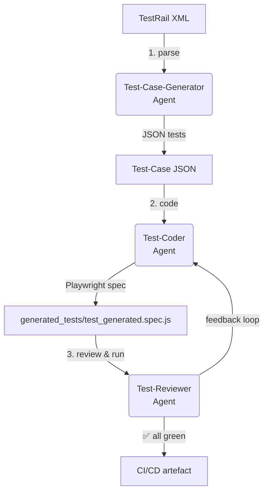

# QA 🧠 AutoAutomation  
[](https://www.python.org/)  
[](https://nodejs.org/)  
[](https://playwright.dev/)  
[](https://openai.com/)  
[](LICENSE)

_End-to-end QA automation powered by a swarm of LLM-based agents._

## ✨ Why this project?

Writing, maintaining and reviewing automated tests is repetitive and time-consuming.  
`QA_AutoAutomation` turns your existing **TestRail** (or any XUnit-like) test cases into fully runnable **JavaScript Playwright** tests – in minutes, not days.

## 🏗️ High-Level Architecture



1. **Generator Agent** – converts XML test cases to a structured JSON schema.  
2. **Coder Agent** – turns JSON into Playwright code, re-using helper utilities provided in `context_playwright/`.  
3. **Reviewer Agent** – executes the tests (Playwright/pytest) **and** uses GPT-4o for a static code review. If it fails, feedback is fed back to the Coder Agent until it passes or `--max-review-cycles` is reached.

## 🚀 Quick Start

### 1. Clone & install

```bash
git clone https://github.com/<you>/QA_AutoAutomation.git
cd QA_AutoAutomation

# Python deps
pip install -r requirements.txt   # or 'uv pip install -r requirements.txt'

# Playwright runtime
# (installs browsers and CLI in a non-interactive way)
npx --yes playwright install --with-deps
```

### 2. Provide your TestRail export

Export the desired suite from TestRail as **XML** and drop it into the repository, e.g.

```
context_test_cases/my_suite.xml
```

### 3. Add context for the Coder Agent  *(optional but highly recommended)*

The more context the LLM sees, the more consistent the generated code will be.

1. Copy existing Playwright specs, fixtures or helpers into `context_playwright/`.
2. These files are injected into the prompt so the Coder Agent can mimic your style & utilities.

### 4. Configure secrets

Create a `.env` file in the project root:

```dotenv
OPENAI_API_KEY=sk-...
```

Any environment variable recognised by the official `openai` Python SDK will work.

### 5. Run the orchestrator 🎬

```bash
python orchestrator.py context_test_cases/my_suite.xml \
  --work-dir artifacts \
  --model gpt-4o-mini \
  --max-review-cycles 3
```

Watch the agents collaborate in real-time.  
Final Playwright spec will be written to `artifacts/generated_tests/`.

## 🛠️ Customising prompts

* **Generator Agent** – edit `Agents/TC_GENERATOR_AGENT/test_writer_main.py::build_prompt`.  
* **Coder Agent** – edit `Agents/CODER_AGENT/test_automator_main.py::_build_prompt`.  
* **Reviewer Agent** – edit `Agents/CODE_REVIEWER_AGENT/test_reviewer_main.py::_static_js_review` (runtime execution command is also configurable).

Prompt engineering is the easiest lever for quality! Tweak the instructions, change the temperature or swap out the model as you see fit.

## 🗂️ Project Layout (important bits)

```
├─ orchestrator.py           # high-level glue code
├─ Agents/
│  ├─ TC_GENERATOR_AGENT/
│  ├─ CODER_AGENT/
│  └─ CODE_REVIEWER_AGENT/
├─ context_test_cases/       # 👉 put your XML files here
├─ context_playwright/       # 👉 optional Playwright helpers/specs for context
└─ artifacts/                # ⏩ auto-generated JSON & test code
```

## 📈 Roadmap

- [ ] Multi-language test generation (Python, TypeScript).
- [ ] Parallelisation & cost optimisation.
- [ ] Integrate with GitHub Actions for automatic PR comments.
- [ ] Support for other test-case management exports (Zephyr, XRay…).

Contributions are welcome – feel free to open an issue or a PR!

## 💌 Acknowledgements

Built with ❤️ using  
- [OpenAI Python SDK](https://github.com/openai/openai-python)  
- [Microsoft Playwright](https://playwright.dev)  
- A dash of [mermaid](https://mermaid.js.org/) diagrams.

---

© 2025 Asher Feldman • Released under the MIT License
